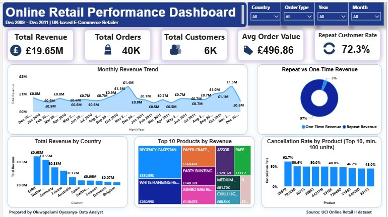

# Online Retail Performance Dashboard

End-to-end data analytics project: cleaning and analyzing two years of real
e-commerce transaction data, building an executive KPI dashboard, and
delivering business recommendations — from raw data to a decision-ready deliverable.

## Business Context

Acting as a newly hired Data Analyst at a UK-based online gift-ware retailer,
this project answers a request from the Head of Sales: a clear view of
business performance and three actionable recommendations, built from two
years of transaction-level data (Dec 2009 – Dec 2011, ~1 million rows).

## Key Findings

1. **Revenue is highly seasonal.** Revenue nearly doubles every October–November
   versus the summer baseline, in both years of data a predictable pattern
   that inventory and staffing planning should be built around.
2. **Retention drives the business.** 72% of customers are repeat buyers,
   generating 96.7% of total revenue, this is a retention-driven business,
   not an acquisition-driven one.
3. **Revenue is concentrated in one market.** 85.5% of revenue comes from the
   UK alone. Ireland, the Netherlands, and Germany are the strongest adjacent
   markets, each still under 4% of revenue, real, largely untapped growth room.

## Dashboard Preview



*(Live interactive version: link to be added once published)*

## Repository Structure

```
├── notebook/
│ └── Online_Retail_KPI_Analysis.ipynb # Full analysis: cleaning, KPIs, EDA
├── dashboard/
│ ├── Online_Retail_Dashboard.pbix # Power BI file (open in Power BI Desktop)
│ └── Online_Retail_Dashboard.pdf # Static export
├── deliverables/
│ ├── Sales_Insights_Summary.docx # 1-page summary for a non-technical manager
│ └── Dashboard_Workflow_Explainer.docx # Plain-language build walkthrough
└── images/
└── dashboard_screenshot.jpeg
```

## Data Source

[UCI Machine Learning Repository — Online Retail II](https://archive.ics.uci.edu/dataset/502/online+retail+ii)
Raw data is not included in this repo due to file size — download from the
source above and run the notebook to regenerate the cleaned datasets.

## Tools & Skills

- **Python** (pandas, matplotlib) — data cleaning, feature engineering, EDA
- **Power BI** — DAX measures, relational data modeling, interactive dashboard design
- **Data cleaning judgment** — explicit, documented decisions on missing values,
  duplicate records, and correctly distinguishing cancelled transactions from
  customer returns based on what the data actually supports
- **Business communication** — translating technical findings into a
  non-technical, action-oriented summary

## Author

Oluwapelumi Abigael Oyesanya — Data Analyst
[LinkedIn](https://www.linkedin.com/in/oluwapelumi-oyesanya) · [Email](mailto:abigaeloyesanya@gmail.com)
